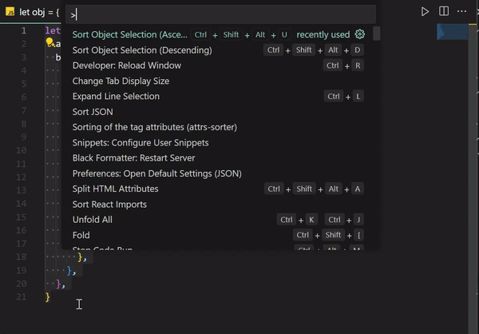

# sort object

Not yet uploaded to the marketplace.

Zero dependency vscode extension to sort selected keys or entire object. 
All nested objects within selection are sorted as well.
Ascending and descending order supported.

